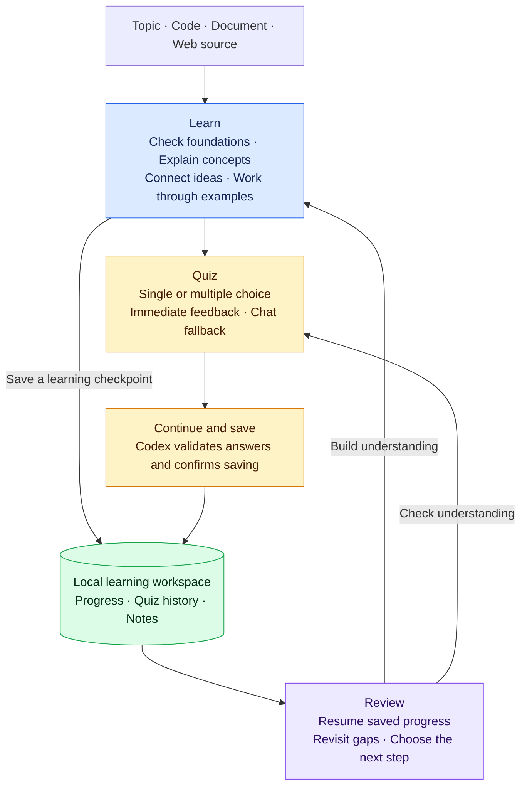

# Learn with Codex

Adaptive lessons, interactive quizzes, and learning notes that resume across Codex tasks. A reusable Windows-first Codex plugin with three skills:

| Skill | Use it to |
| --- | --- |
| Learn | Learn from foundations, check prerequisites, and connect concepts. |
| Quiz | Practice with single/multiple-choice questions and validated feedback. |
| Review | Resume from saved evidence and revisit unresolved gaps. |

## Function overview

Start with a topic, code, a document, or a web source. Move between lessons, practice, and review as your understanding grows.



Saved files let a new Codex task resume your learning. Quiz attempts are saved only after Codex validates the submitted answers and confirms the write.

## Requirements

- Codex with plugin support and the `codex` CLI on PATH for the commands below.
- Node.js 22 or newer on PATH (`node --version`). No npm dependencies or separate API key.
- The Visualize skill for interactive quizzes. Without it, use numbered chat answers with the same grading and saving logic.
- A writable learning workspace.

## Install from GitHub

After this repository is published, replace `OWNER` with its GitHub owner:

```powershell
codex plugin marketplace add OWNER/learn-codex
codex plugin add learn-codex@codex-learning
```

Start a fresh Codex task after installation. If the plugin does not appear, restart the desktop app. This repository includes the supported Codex compatibility manifest and its own marketplace catalog.

## Install from a local checkout

From this repository's root:

```powershell
codex plugin marketplace add .
codex plugin add learn-codex@codex-learning
```

If you already have `learn-codex@personal` installed, enable just one copy when testing to avoid duplicate skills.

## Try a lesson

Open a task in the folder where you want to keep your learning notes, then ask:

> Use the learn-codex Learn skill to teach me TCP from the foundations.

Follow with **“Quiz me on this lesson.”** Select answers, check feedback, then click **Continue and save**. Send the follow-up if prompted and wait for Codex to confirm the file update. A submitted interface message alone is not confirmation that progress was saved.

Later, open a new task in the same folder and ask **“Review my gaps and continue learning.”** Progress lives in that workspace's `.learning/<topic>/`, separate from the installed plugin:

- `state.json`: canonical progress, quizzes, and attempts.
- `generated.md`: generated summaries and quiz results.
- `learner.md`: your own notes, preserved by the helper.

## Development

Run the existing test suite from the repository root:

```powershell
npm test
```

No `npm install` is needed. GitHub Actions runs these tests on Windows and Linux with Node.js 22. Browser smoke tests require an existing Playwright/browser installation and are documented in the [plugin guide](plugins/learn-codex/README.md).

See the [helper contract](plugins/learn-codex/references/workflow.md) and [quiz adapter guide](plugins/learn-codex/references/quiz-interface.md) for implementation details.

## Publish your copy

Follow [PUBLISHING.md](PUBLISHING.md) to push this local repository to GitHub and test installation from it. The GitHub owner is intentionally not assumed from the local Git author name.

## Attribution

The teaching approach was adapted from [amosblomqvist/learn](https://github.com/amosblomqvist/learn). This repository contains the Codex implementation, without the original pi runtime or the bundled Visualize plugin. See [NOTICE.md](NOTICE.md) for provenance and licensing status.

Codex distribution reference: [Package your plugin](https://developers.openai.com/plugins/build/plugins).
