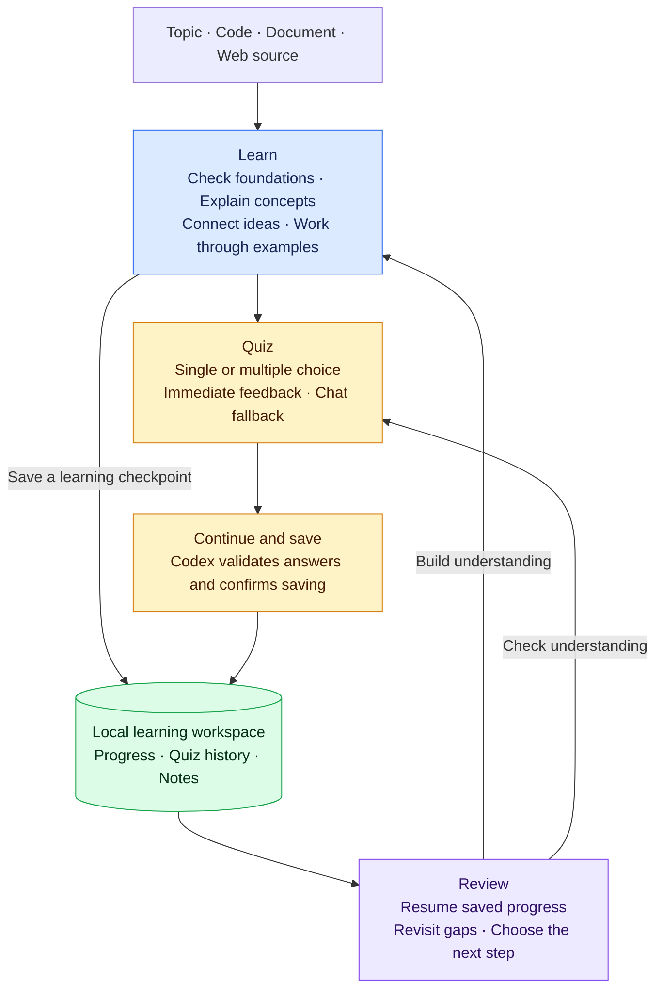

# Learn with Codex

A Codex plugin for learning a topic through guided lessons, worked examples, and quizzes. Start from what you already know, save your progress locally, and pick up where you left off in a new Codex task.

## Start with a prompt

After [installing the plugin](#installation), open a new Codex task in the folder where you want to keep your learning notes. Copy this prompt and fill in the brackets:

```text
Use Learn with Codex to teach me [topic]. I already know [background].
My goal is [goal]. Teach one concept at a time, use examples, and quiz me
before moving on.
```

For example:

> Use Learn with Codex to teach me TCP. I already know basic Python and how to make HTTP requests. My goal is to understand how reliable network connections work and debug common connection problems. Teach one concept at a time, use examples, and quiz me before moving on.

You can also start from a codebase, a document, or a web source. Include the relevant file or link in your prompt and describe what you want to understand.

## What it does

| Skill | Use it to |
| --- | --- |
| Learn | Build understanding with explanations and examples adapted to your background. |
| Quiz | Check understanding with single- or multiple-choice questions and immediate feedback. |
| Review | Resume saved progress, revisit mistakes, and choose what to learn next. |

Lessons, practice, and review form a learning loop:



## Installation

### Requirements

- Codex with plugin support and the `codex` CLI on PATH for the commands below.
- Node.js 22 or newer on PATH (`node --version`). No npm dependencies or separate API key.
- The Visualize skill is optional for inline interactive quizzes. Without it, use numbered chat answers with the same grading and saving logic.
- A writable learning workspace.

### From GitHub

Run these commands in your terminal:

```powershell
codex plugin marketplace add zjphys/learn-codex
codex plugin add learn-codex@codex-learning
```

Start a fresh Codex task after installation. If the plugin does not appear, restart the desktop app. You can select **Learn**, **Quiz**, or **Review learning** from the plugin's skills.

### From a local checkout

From this repository's root:

```powershell
codex plugin marketplace add .
codex plugin add learn-codex@codex-learning
```

If you have another copy of Learn with Codex installed, enable only one copy to avoid duplicate skills. For details on marketplace sources, see the [official plugin packaging guide](https://developers.openai.com/plugins/build/plugins).

### Updates

Refresh the marketplace and reinstall, then start a new Codex task:

```powershell
codex plugin marketplace upgrade codex-learning
codex plugin add learn-codex@codex-learning
```

## Practice and resume

After a lesson, ask:

> Quiz me on this lesson.

In an interactive quiz, select answers, check the feedback, and click **Continue and save**. Send the follow-up if prompted and wait for Codex to confirm that your attempt was saved. Closing the quiz without completing this step does not save the attempt. If the interactive interface is unavailable, answer in chat.

To continue later, open a new Codex task in the same folder and ask:

> Use Learn with Codex to review my gaps and continue learning TCP.

Codex reads the saved progress to resume, even when the previous conversation is unavailable.

## Your learning notes

Progress is stored in the folder where you learn, separate from the installed plugin:

```text
.learning/<topic>/
  state.json     # Progress, checkpoints, quizzes, and attempts
  generated.md   # Generated lesson summaries and quiz results
  learner.md     # Your own notes, preserved by the helper
```

The plugin saves learning checkpoints and validated quiz attempts. It does not automatically capture full transcripts or commit your notes to Git. This repository ignores `.learning/`; add the same entry to other learning repositories if you want to keep those notes out of version control.

## Development

Run the existing test suite from the repository root:

```powershell
npm test
```

No `npm install` is needed. GitHub Actions runs these tests on Windows and Linux with Node.js 22. Browser smoke tests require an existing Playwright/browser installation and are documented in the [plugin guide](plugins/learn-codex/README.md).

See the [helper contract](plugins/learn-codex/references/workflow.md) and [quiz adapter guide](plugins/learn-codex/references/quiz-interface.md) for implementation details.

## Attribution

The teaching approach was adapted from [amosblomqvist/learn](https://github.com/amosblomqvist/learn). This repository contains the Codex implementation, without the original pi runtime or the bundled Visualize plugin. See [NOTICE.md](NOTICE.md) for provenance and licensing status.
